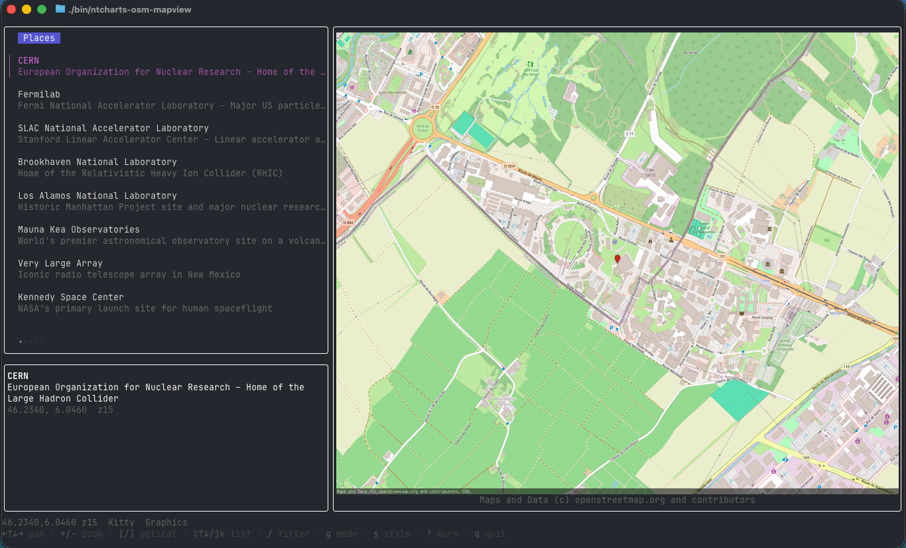

# ntcharts-osm — Terminal OpenStreetMap widget for Bubble Tea

<p>
    <a href="https://github.com/NimbleMarkets/ntcharts-osm/tags"></a>
    <a href="https://pkg.go.dev/github.com/NimbleMarkets/ntcharts-osm?tab=doc"></a>
    <a href="https://github.com/NimbleMarkets/ntcharts-osm/blob/main/CODE_OF_CONDUCT.md"></a>
</p>

`ntcharts-osm` is a [Bubble Tea](https://github.com/charmbracelet/bubbletea) widget that renders OpenStreetMap tiles in the terminal. It pairs [`flopp/go-staticmaps`](https://github.com/flopp/go-staticmaps) for tile fetching with [`ntcharts/v2/picture`](https://github.com/NimbleMarkets/ntcharts) for image rendering — half-block glyphs anywhere, full-resolution Kitty graphics on terminals that support them (Kitty, Ghostty, WezTerm).

<p align="center"></p>

## Quickstart

```go
package main

import (
    "fmt"
    "os"

    tea "charm.land/bubbletea/v2"
    "github.com/NimbleMarkets/ntcharts-osm/mapview"
)

type model struct{ mv mapview.Model }

func (m model) Init() tea.Cmd { return m.mv.Init() }

func (m model) Update(msg tea.Msg) (tea.Model, tea.Cmd) {
    if k, ok := msg.(tea.KeyMsg); ok && (k.String() == "q" || k.String() == "ctrl+c") {
        return m, tea.Quit
    }
    if sz, ok := msg.(tea.WindowSizeMsg); ok {
        m.mv.SetSize(sz.Width, sz.Height)
    }
    var cmd tea.Cmd
    m.mv, cmd = m.mv.Update(msg)
    return m, cmd
}

func (m model) View() tea.View { return m.mv.View() }

func main() {
    mv := mapview.New(0, 0)
    mv.SetLatLng(40.6892, -74.0445, 13) // Statue of Liberty
    if _, err := tea.NewProgram(model{mv: mv}).Run(); err != nil {
        fmt.Println(err); os.Exit(1)
    }
}
```

Pan with arrows or `hjkl`, zoom with `+`/`-`. The widget owns those bindings — no parent wiring needed.

## Demo

A fuller single-pane demo lives at [`examples/mapview`](./examples/mapview/main.go) — adds tile-style cycling and Glyph/Kitty mode toggling.

```sh
task build-ex-mapview
./bin/ntcharts-osm-mapview
```

## Tile styles

`mapview.SetStyle(...)` switches between nine tile providers from [`flopp/go-staticmaps`](https://github.com/flopp/go-staticmaps): `Wikimedia`, `OpenStreetMaps`, `OpenTopoMap`, `OpenCycleMap`, `CartoLight`, `CartoDark`, `StamenToner`, `StamenTerrain`, `ArcgisWorldImagery`. Each comes with the upstream provider's terms-of-use and attribution requirements — read them before shipping a public app.

## Render modes

| Mode | What it does | Where it works |
|---|---|---|
| `mapview.RenderGlyph` (default) | Half-block ANSI from [`pixterm/ansimage`](https://github.com/eliukblau/pixterm), via `ntcharts/v2/picture` | Any modern terminal |
| `mapview.RenderKitty` | Full-resolution image via Kitty graphics protocol | Kitty, Ghostty, WezTerm |

`mv.SetRenderMode(mode)` returns a `tea.Cmd` that re-renders at the new mode. Toggling away from Kitty automatically deletes the uploaded image so no ghost stays in the terminal.

## Bubble Tea version

Targets Bubble Tea **v2** (`charm.land/bubbletea/v2`). No v1 backport.

## Routing messages across multiple picture owners

`mapview.IsMapUpdate(msg)` is a **"may need this"** predicate, not an ownership predicate. It returns `true` for both mapview's own messages *and* for every `picture.IsPictureMsg` (Kitty frames, cell-size events, capability probes). Picture messages are program-wide — they belong to the runtime, not to any one model.

If your program embeds `picture.Model` in more than one place (say, a `mapview.Model` *and* a `pictureurl.Model` rendering a product image), do NOT route picture messages with `else if` — broadcast them to every picture owner, otherwise one of them will starve:

```go
mapMsg := mapview.IsMapUpdate(msg)
prodMsg := pictureurl.IsPictureMsg(msg)

if mapMsg || prodMsg {
    var cmds []tea.Cmd
    if mapMsg {
        var cmd tea.Cmd
        m.mv, cmd = m.mv.Update(msg)
        cmds = append(cmds, cmd)
    }
    if prodMsg {
        var cmd tea.Cmd
        m.prod, cmd = m.prod.Update(msg)
        cmds = append(cmds, cmd)
    }
    return m, tea.Batch(cmds...)
}
```

For the narrower "is this message owned by mapview alone" predicate (the `MapCoordinates` input, async tile-render results, debounce ticks), use `mapview.IsMapOwnMsg(msg)`. Each model's own `Update` already filters by instance ID where applicable, so broadcasting picture messages is safe.

## Known caveats

- **Tile fetching is synchronous per render.** Each render builds its own `*sm.Context` inside the dispatched goroutine and tags the result with a generation counter, so rapid pan / zoom / resize fires safely-parallel renders and stale results are dropped. Composited images are kept in a small per-Model LRU keyed on `(lat, lng, zoom, cols, rows, style, oversample, markers)` — revisiting a state hits the cache synchronously (no goroutine, no Loading overlay). Default cap is 16 entries; tune via `mapview.NewWithConfig(Config{CacheCap: N})` (`-1` disables caching).
- **Server-side supersample (`Config.Oversample`).** Raises the source-image pixel density without changing visible geographic coverage — `Oversample: N` (powers of 2) renders the same area at `N×` per-cell resolution and `+log2(N)` OSM tile zoom, so Kitty terminals can downscale a sharper source. `1` (default) keeps current behavior; `2` is a noticeable boost; `4` is hi-DPI quality at ~16× the tile fetches. Capped so the effective tile zoom never exceeds 19. Glyph mode pays the cost without visible benefit.
- **Client-side optical zoom (`Config.OpticalZoom` / `mv.SetOpticalZoom(n)`).** Magnifies the *cached* source image by cropping the center `1/2^n` of each axis and letting the renderer scale it back up to the cell rectangle. No network, no tile-render goroutine — switching is instant. Pixelated at high N (it's digital zoom in spirit even though we call it optical), but useful for going past the OSM tile-zoom ceiling or just inspecting fine detail without re-fetching. Composes with `Oversample`: e.g. `Oversample: 2` + `OpticalZoom: 1` is a 2× zoomed view rendered from a 2× supersampled source.
- **Aspect-ratio guardrail (`Config.MaxAspectRatio` / `Config.LetterboxColor`).** Maps display correctly at any cell-rect AR — every pixel sits at its true geographic location — but at extreme ARs (a 100×5 status bar, say) viewers find the result disorienting because their mental model of "a map" is roughly square. `MaxAspectRatio: 3.0` lets the cell rect's AR range up to 3:1 in either direction; beyond that, the map portion is rendered at the boundary AR centered in the cell rect, with the rest filled by `LetterboxColor` (default opaque black; `color.Transparent` shows the terminal background through the bars). The letterbox is composed into the source image *before* picture renders, so Glyph and Kitty show identical letterbox geometry — toggling render modes doesn't change layout. Default `0` keeps the current "fill the cell rect at any AR" behavior; opt in when your layout might land in extreme territory.
- **No built-in API key handling.** Tile providers that require a key (e.g. Thunderforest) are not bundled — add a custom `tileProvider` if you need one.
- **Geocoding uses Nominatim** with no caching. Respect their [usage policy](https://operations.osmfoundation.org/policies/nominatim/) for production traffic.

## License

Many thanks to the **OpenStreetMap Foundation** ([donate](https://supporting.openstreetmap.org/donate/)).

[MIT License](./LICENSE.txt) — Copyright (c) 2026 [Neomantra Corp](https://www.neomantra.com).

----
Made with :heart: and :fire: by the team behind [Nimble.Markets](https://nimble.markets).
